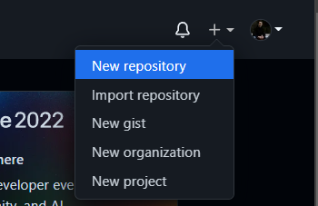
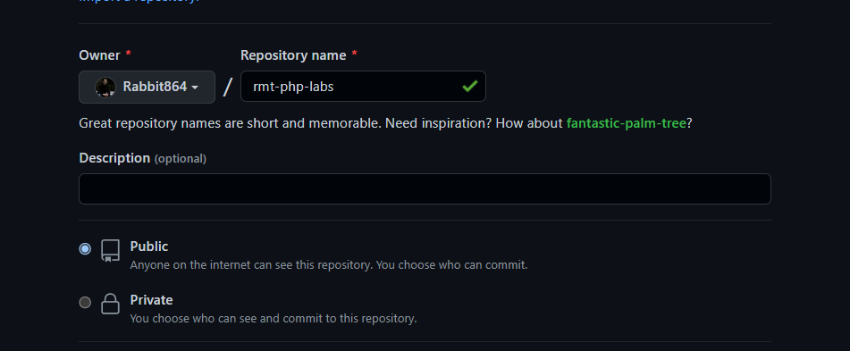
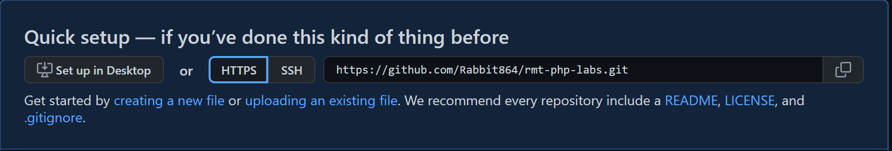

# Создание репозитория Git / Github

## Github

1) Перейдите на Github - https://github.com
2) Зарегистрируйтесь на Github
3) Для того, чтобы создать репозиторий нажмите на кнопку ***New*** или знак ***+*** в правом верхнем углу и далее ***New repository***




4) Далее нужно дать имя репозиторию и выбрать тип репозитория ***Public*** или ***Private*** 




## Git - настройка 

Изначально для работы с git вам нужно указать ваши данные для этого в консоли нужно прописать:

```git config --global user.name "Ваш username"```

```git config --global user.email Ваш почтовый адрес(example@gmail.com)```

## Git - создание репозитория

1) Создайте папку для ваших лабораторных работ или проекта
2) Проиницилизируйте папку с помощью команды - ```git init```
3) Далее вам нужно создать ссылку с удаленным репозиторием для этого пропишите:

   ```git remote add origin сслыка_на_ваш_проект```

Ссылку на проект вы можете увидеть, когда создали репозиторий на Github


## Git - клонирование

Для того чтобы склонировать репозиторий используйте:

```git clone <ссылка на ваш репозиторий>``` 

Будет создана папка с названием удаленного репозитория.

## Основные команды 

```git init``` - инициализация репозитория git

```git clone <url>``` - клонирование репозитория

```git clone <url> <name>``` - клонирование репозитория, но название папки будет соотвествовать ＜name＞

```git remote``` - просмотр каждого подключения к удаленному репозиторию

```git remote add <name> <url>``` - создание нового подключения к удаленному репозиторию

```git remote rm <name>``` - удаление подключения к удаленному репозиторию с именем ＜name＞

```git remote <old-name> <new-name>``` - переименование удаленного подключения  с имени ＜old-name＞ на ＜new-name＞